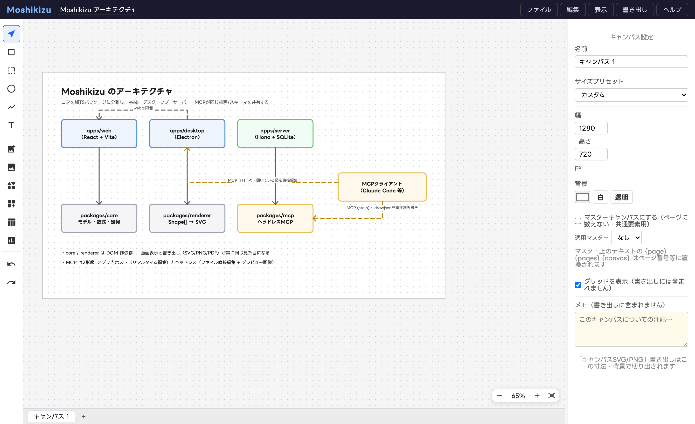

# Moshikizu（模式図）

PowerPoint 資料などに載せる**模式図・概念図**を、非イラストレーターが簡便に作るためのドローイングツールです。汎用のイラストアプリではなく、「少ない操作で整った図」に特化しています。



> **開発状況**: 現在アクティブに開発中です。ドキュメント形式（.drawjson）には互換性維持の仕組みがありますが、大きな変更が入ることがあります。

🏠 **[プロダクト紹介ページ](https://yupyom.github.io/moshikizu/)** — スクリーンショットと機能紹介
🕹️ **[ブラウザで試す（プレイグラウンド）](https://yupyom.github.io/moshikizu/app/)** — インストール不要。データは手元のファイルに保存されます（MCP 連携はデスクトップ版のみ）
📘 **[ユーザーガイド（マニュアル）](https://yupyom.github.io/moshikizu/manual/)** — チュートリアル・機能ガイド・MCP 連携・サーバー設置

## 特徴

- **図に特化した描画**: 矩形・角丸・楕円・折れ線（直交/曲線）・テキスト・SVG/画像配置。点線・矢印など先端7種・線幅/先端サイズの数値指定
- **後からぜんぶ編集できる**: 線のウェイポイント（ダブルクリックで編集モード、Shift+クリックで点の追加/削除）、画像の非破壊トリミング、すべてのプロパティ
- **マルチキャンバス**: 1ファイルに複数のアートボード（16:9 / 4:3 / A4 / 正方形などのプリセット付き）
- **書き出し**: SVG / PNG（倍率1〜4x、Webフォント埋め込み、透明背景対応）
- **Webフォント**: Google Fonts から選択・オフラインキャッシュ・書き出し埋め込み
- **テーマ**: ブランドカラー・フォントのセットを保存・共有（.drawtheme.json）
- **MCP サーバー同梱**: Claude Code 等のエージェントに図の作成・修正を頼める
  - ヘッドレス版（ファイル直接編集）とアプリ内ホスト版（開いている図をリアルタイム編集・undo可）の2形態
  - ※ローカルインストール専用（ブラウザ版プレイグラウンド・サーバー経由のブラウザ利用では使えません）
- **3プラットフォーム**: ブラウザ / macOS / Windows（Electron）

## 必要環境

- [Node.js](https://nodejs.org/) 20 以上（npm 同梱）
- git

## インストールと起動

### かんたんインストール（推奨）

```bash
# macOS / Linux
curl -fsSL https://raw.githubusercontent.com/yupyom/moshikizu/main/install.sh | bash

# Windows (PowerShell)
irm https://raw.githubusercontent.com/yupyom/moshikizu/main/install.ps1 | iex
```

ソース一式を `~/.moshikizu`（Windows は `%USERPROFILE%\.moshikizu`）に取得し、
デスクトップアプリをビルド・配置します。

- **macOS**: `/Applications/Moshikizu.app`（コード署名なしのため、初回は**右クリック > 開く**で起動）
- **Windows**: スタートメニューの「Moshikizu」から起動（本体は `%LOCALAPPDATA%\Programs\Moshikizu`。
  SmartScreen 警告が出たら「詳細情報 > 実行」）
- **Linux**: `moshikizu` コマンドでブラウザ版が起動

**アップデートも同じコマンドの再実行**です（git pull → 再ビルド → アプリ差し替え。データや設定は消えません）。
新しいバージョンが出ているかは、アプリの「ヘルプ > 更新を確認」でも確認できます
（環境設定で main=安定版 / dev=プレリリース のチャンネルを選択）。

### 手動セットアップ

```bash
git clone https://github.com/yupyom/moshikizu.git
cd moshikizu
npm install
```

### ブラウザで使う

```bash
./start.sh          # → http://localhost:5173
```

### デスクトップアプリとして使う

```bash
npm run desktop     # ビルドして Electron で起動
```

### macOS アプリ（.app）を作る

```bash
npm run build
npm run package -w @draw/desktop
# → apps/desktop/release/mac-arm64/Moshikizu.app
```

コード署名はしていません（オープンソースのフリーソフトのため）。自分でビルドした .app はそのまま起動できます。

## チームで使う（コラボサーバー）

共同作業（サーバー保存・作成者記録・コメント・テーマ共有）をしたい場合だけ、
セルフホストのサーバーを立てます。**個人利用なら不要**です
（静的な `apps/web/dist` をレンタルサーバー等に置くだけでもWeb版は完全動作します）。

### Docker で動かす（推奨）

```bash
docker build -t moshikizu .
docker run -d -p 8940:8940 -v moshikizu-data:/data --name moshikizu moshikizu
docker exec -it moshikizu node server/index.js adduser <ユーザー名> <パスワード>
# → http://サーバー:8940
```

### 直接動かす

```bash
npm run build && npm run build -w @draw/server
node apps/server/dist/index.js adduser <ユーザー名> <パスワード>
node apps/server/dist/index.js        # → http://localhost:8940
```

### 設定とセキュリティ

- 設定ファイル `server-data/config.json`（Dockerでは `/data/config.json`）は
  **初回起動時に自動生成**されます。編集後はサーバーを再起動してください。
  全項目の説明は[サーバー設置ガイド](https://yupyom.github.io/moshikizu/manual/server/)へ
- **IPv4ホワイトリスト**: config.json の `ipAllowlist` に IP または CIDR を列挙
  （例: `["203.0.113.5", "192.168.1.0/24"]`）。空の場合は全IP許可（ループバックは常時許可）
- **2段階認証（TOTP）**: ログイン後「ファイル > サーバー > 2段階認証を設定」でQRコードを認証アプリに登録
- パスワードは scrypt ハッシュで保存。TLS が必要な場合は Caddy / nginx 等の
  リバースプロキシを手前に置いてください

### デプロイ先の目安

| 環境 | 可否 |
|---|---|
| VPS + Docker（Dokploy / Coolify 等） | ◎ 推奨 |
| VPS 直置き（systemd / pm2） | ◎ |
| Fly.io / Railway / Render（永続ディスク付き） | ○ |
| Heroku・AWS Lambda 等（ファイル揮発/サーバーレス） | × SQLite が保持できません |
| 共用レンタルサーバー | × 常駐Node不可（ただし静的Web版の設置は○） |

## エージェント連携（MCP）

MCP はローカルインストール専用の機能です（アプリ内ホスト版はデスクトップ版のみ。
プレイグラウンドやサーバー経由のブラウザ利用では使えません）。

### ヘッドレス版（ファイルを直接編集）

```bash
npm run build -w @draw/mcp
claude mcp add moshikizu -- node <このリポジトリ>/packages/mcp/dist/index.js
```

### アプリ内ホスト版（開いている図をリアルタイム編集）

デスクトップ版の「環境設定 > MCPホスト」を有効化してから:

```bash
claude mcp add moshikizu-app --transport http http://localhost:8930/mcp
```

ツール一覧・図形JSON仕様・Python からの直接利用サンプルは、アプリ内の
**ヘルプ > MCP / APIリファレンス** を参照してください。

## 開発

```bash
npm test            # 全ワークスペースのテスト
npm run typecheck   # 型チェック
npm run lint        # lint
```

構成: npm workspaces のモノレポです。

| パッケージ | 内容 |
|---|---|
| `packages/core` | 図形モデル・スキーマ・ジオメトリ（純TS） |
| `packages/renderer` | Shape[] → SVG 文字列（ヘッドレス動作可） |
| `packages/mcp` | ヘッドレス MCP サーバー（stdio） |
| `apps/web` | Vite + React のアプリ本体 |
| `apps/desktop` | Electron シェル + アプリ内 MCP ホスト |

## ライセンス

[MIT](./LICENSE)
