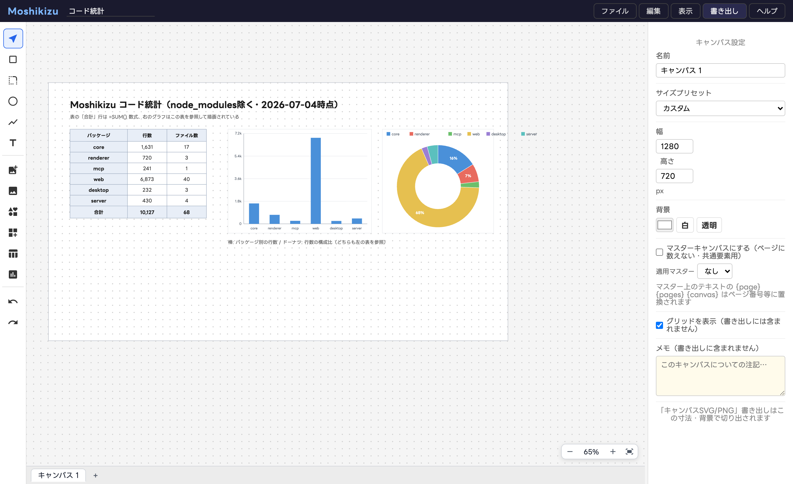

# 機能ガイド

## キャンバス（ページ）

画面下のタブでキャンバスを切り替えます。**＋**で追加、ダブルクリックで名前変更、
**ドラッグで並べ替え**（PDF のページ順になります）。
何も選択していないときの右パネルがキャンバス設定です（寸法プリセット・背景色/透明・グリッド表示）。

### マスターキャンバス

キャンバス設定の「マスターキャンバスにする」でマスター化（タブに Ⓜ 表示）。
他のキャンバスは「適用マスター」を選ぶと、マスターの図形が背面に共通表示されます。
マスター上のテキストに `{page}` `{pages}` `{canvas}` と書くと、ページ番号・総ページ数・
キャンバス名に置換されます（ノンブルは `{page} / {pages}`）。

### PDF 書き出し

「書き出し > PDF」で複数ページ PDF を作成します。ページ順はタブ順（マスター除く）、
範囲指定は `1,3,4-5` 形式です。

## 表と数式・グラフ

ツールバーの表アイコンで挿入し、**セルをダブルクリック**して編集します。

- セル先頭に `=` で数式: 四則演算・セル参照（`A1`）・範囲（`A1:B3`）・`SUM` / `AVG`
- 数値書式（カンマ・小数点桁・%）はセル単位で設定可能（MCP/ファイル編集から）
- プロパティパネルで行列の追加/削除・行高/列幅の統一・罫線・ヘッダー/フッター

グラフはツールバーのグラフアイコンで挿入し、**表を参照**して描画されます
（棒・折れ線・円・ドーナツ・レーダー・散布図・ウォーターフォール）。
表を書き換えるとグラフも追従します。別キャンバスの表も参照できます。

## 画像と非破壊トリミング

画像（PNG/JPEG等）はドキュメントに埋め込まれます。**ダブルクリック**でトリミングモードに
入り、枠で範囲調整・窓内ドラッグで画像をずらせます。元データは保持され、何度でも
やり直せます。コーナーリサイズは縦横比を維持します。

## アイコンとアセット

- **アイコンライブラリ**: Iconify のオープンソースアイコンを検索してクリック配置。
  ☆でマイライブラリに保存、自分の SVG も登録できます
- **アセットライブラリ**: 図形の組み合わせを部品として登録 → 配置はインスタンス。
  **同名で再登録するとマスター更新**となり全インスタンスに反映。インスタンスごとに
  テキストだけ差し替えられます（プレースホルダー）

## テーマとフォント

環境設定でカラーパレット・フォント・線幅をまとめて「テーマ」として保存・適用できます。
`.drawtheme.json` でエクスポート/インポートでき、サーバー版ではチーム共有も可能です。
フォントは Google Fonts から選択（日本語24候補+任意指定）。書き出し PNG/PDF には
使用文字分だけサブセット埋め込みされます。

## 主なショートカット

ヘルプ > ショートカット一覧 に全リストがあります。
⌘S 保存 / ⌘F 検索置換（正規表現対応）/ ⌘G グループ化 / ⌘]・⌘[ 重なり順 /
⌘+・⌘−・⌘0・⌘1 ズーム / Space+ドラッグ パン / Alt+ドラッグ 複製 / 矢印キー 移動
