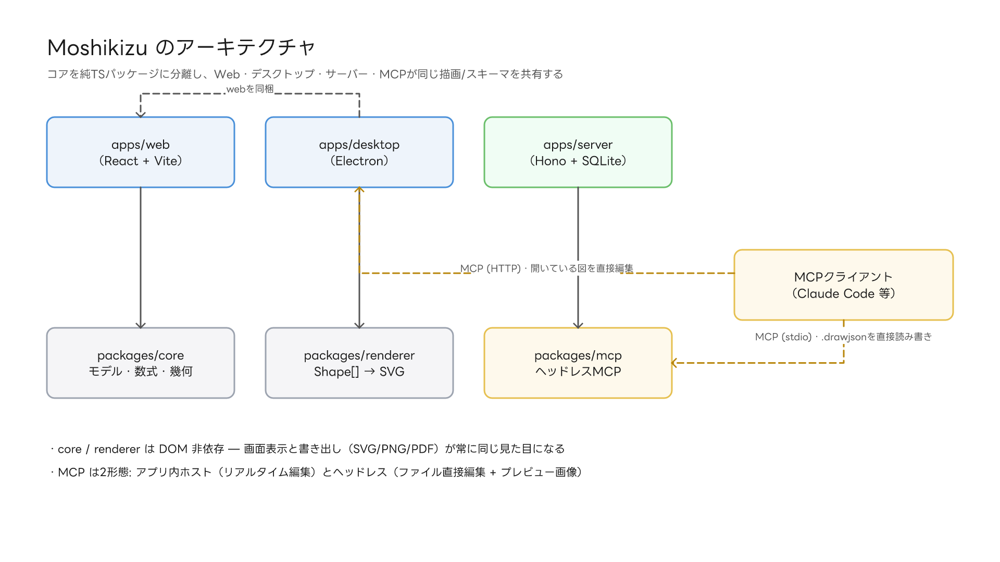
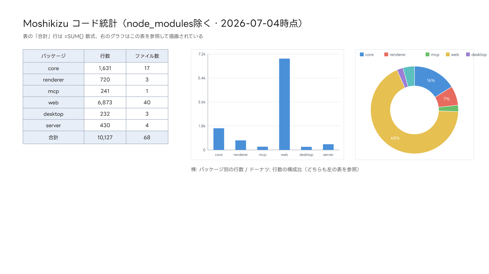

# エージェント連携（MCP）とAPI

Moshikizu は MCP（Model Context Protocol）サーバーを2形態で同梱しています。
このガイドの図やサンプル文書は、実際にこの機能で Claude が描いたものです。



## 1. ヘッドレス版（ファイルを直接編集）

アプリを起動せず `.drawjson` を読み書きします。Claude Code への登録:

```bash
npm run build -w @draw/mcp
claude mcp add moshikizu -- node <リポジトリ>/packages/mcp/dist/index.js
```

ツール: `create_document` / `get_document` / `list_shapes` / `add_shapes` /
`update_shape` / `delete_shapes` / `add_canvas` / `update_canvas` /
`render_svg` / `render_png`

`render_png` はプレビュー画像を返すので、エージェントは**自分の描いた図を見て修正**できます。

## 2. アプリ内ホスト版（開いている図をリアルタイム編集）

デスクトップ版の 環境設定 > MCPホスト を有効化してから:

```bash
claude mcp add moshikizu-app --transport http http://localhost:8930/mcp
```

エージェントの編集が**その場でキャンバスに反映**され、⌘Z で巻き戻せます。

## 図形JSONの仕様・Pythonからの利用

アプリ内の **ヘルプ > MCP / APIリファレンス** に、図形JSONの全仕様と
Python から JSON-RPC を直接叩くサンプルコードがあります。
メッセージは改行区切りの JSON-RPC 2.0（initialize → notifications/initialized → tools/call）です。

## 実例: このガイドの統計図

`samples/stats.drawjson` は「表（=SUM数式入り）+ それを参照する2つのグラフ」を
MCP の `add_shapes` 2回で生成したものです。


