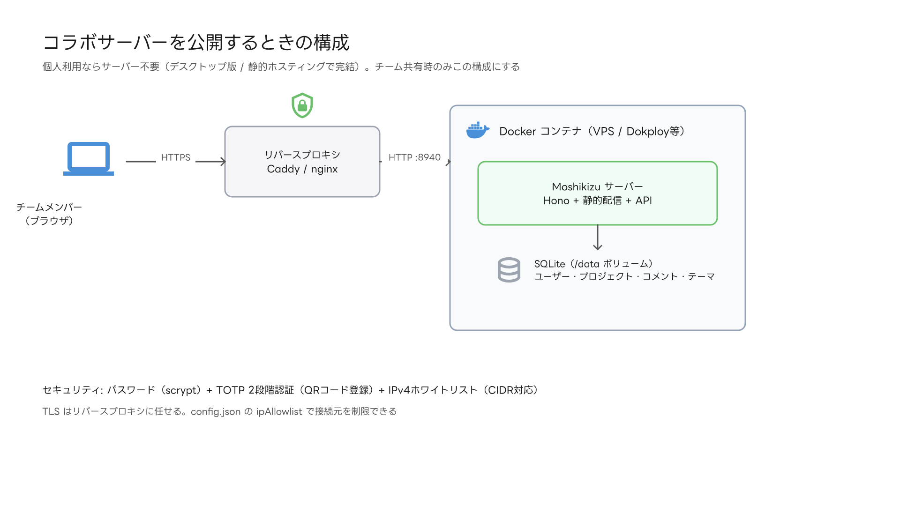

# サーバー設置ガイド（チーム共有）

**個人利用ならサーバーは不要です。** デスクトップ版、または `apps/web/dist` を
レンタルサーバー等に置くだけの静的ホスティングで完結します。
チームでの共有（サーバー保存・作成者記録・コメント・テーマ共有）をしたい場合のみ、
コラボサーバーを立てます。



## Docker で動かす（推奨）

```bash
docker build -t moshikizu .
docker run -d -p 8940:8940 -v moshikizu-data:/data --name moshikizu moshikizu
docker exec -it moshikizu node server/index.js adduser <ユーザー名> <パスワード>
```

## 直接動かす

```bash
npm run build && npm run build -w @draw/server
node apps/server/dist/index.js adduser <ユーザー名> <パスワード>
node apps/server/dist/index.js     # → http://localhost:8940
```

## セキュリティ設定

- **2段階認証（TOTP）**: ログイン後「ファイル > サーバー > 2段階認証を設定」で
  QRコードを認証アプリ（Google Authenticator 等）に登録
- **IPv4 ホワイトリスト**: `server-data/config.json`（Docker では `/data/config.json`）の
  `ipAllowlist` に IP / CIDR を列挙。例: `["203.0.113.5", "192.168.1.0/24"]`。
  空なら全許可（ループバックは常時許可）
- パスワードは scrypt ハッシュ保存。**TLS は Caddy / nginx 等のリバースプロキシ**を
  手前に置いてください

## ゲスト共有リンク

ログインユーザーは「ファイル > サーバー > プロジェクト一覧」の**共有**ボタンから、
プロジェクトごとのゲスト共有リンクを発行できます。

- **共通パスワード**つき（scryptハッシュで保存。パスワードはリンクとは別の手段で伝達を）
- モードは**閲覧のみ** / **閲覧+コメント**の2種。ゲストは編集できません
- ゲストは表示名を入れてコメントでき、`ゲスト: ○○` として記録されます
- リンクは発行者がいつでも失効できます（失効と同時にゲストセッションも無効化）
- IPv4ホワイトリストは共有リンクにも適用されます。外部ゲストを招く場合は許可リストに含めてください

## メール通知（SMTP・任意）

`config.json` に SMTP を設定すると、招待メールとコメント通知が有効になります。

```json
{
  "baseUrl": "https://draw.example.com",
  "smtp": {
    "host": "smtp.example.com",
    "port": 587,
    "secure": false,
    "user": "notify@example.com",
    "pass": "********",
    "from": "Moshikizu <notify@example.com>"
  }
}
```

- **ユーザー招待**: プロジェクト一覧の「ユーザーを招待」からユーザー名とメールを入力 →
  招待リンクがメール送信され、受け取った本人がパスワードを設定して有効化。
  SMTP未設定でも招待リンクは発行され、URLを手動で渡せます
- **コメント通知**: コメント投稿時に、メールアドレス登録済みの他ユーザーへ通知
- `baseUrl` はメールに記載するリンクの生成に使われます（未設定時は localhost）

## デプロイ先の目安

| 環境 | 可否 |
|---|---|
| VPS + Docker（Dokploy / Coolify 等） | ◎ 推奨 |
| VPS 直（systemd / pm2） | ◎ |
| Fly.io / Railway / Render（永続ディスク） | ○ |
| Heroku / Lambda 等（FS揮発・サーバーレス） | × SQLite が保持できない |
| 共用レンタルサーバー | × 常駐Node不可（静的Web版の設置は○） |
