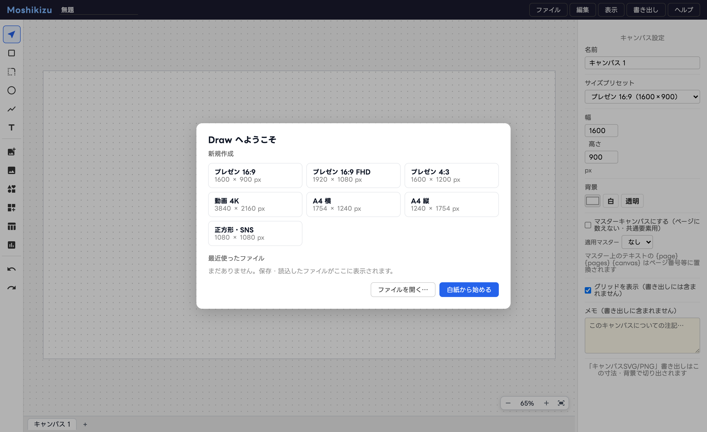
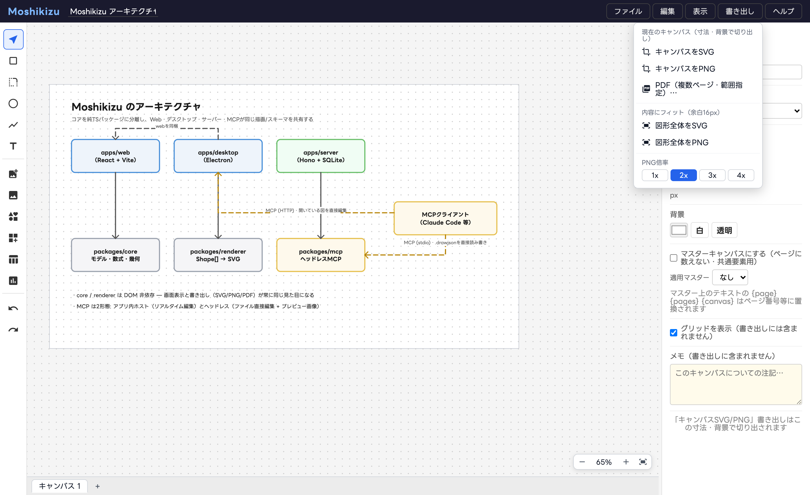

# チュートリアル — はじめての図

## 1. 起動と新規作成

起動するとダッシュボードが開きます。キャンバスサイズ（プレゼン16:9 / A4 など）を選ぶか、
「白紙から始める」をクリックします。

## 2. 図形を描く

左のツールバーから選びます。ショートカット: **V**=選択 / **R**=矩形 / **O**=楕円 / **L**=線 / **T**=テキスト。

- **矩形・楕円**: ドラッグで描画。ダブルクリックでラベル文字を入力
- **線**: クリックでポイントを追加し、ダブルクリックで確定。終端は自動で矢印
- **テキスト**: クリックして入力。Enter で改行、⌘Enter で確定

## 3. 線を仕上げる

線を**ダブルクリック**すると編集モードに入ります。

- ポイントをドラッグで移動、**Shift+クリック**で追加/削除
- 右クリックメニューで「曲線にする」→ 緑のハンドルで曲がり方を調整
- プロパティパネルで 破線 / 先端の種類・サイズ / 線幅 を変更

線の端点を図形の上にドラッグして離すと**連結**され、図形を動かすと線が追従します。

## 4. 整えて書き出す

- 複数選択して プロパティパネル上部の整列ボタン、⌘G でグループ化
- 「書き出し」メニューから SVG / PNG / PDF を選択

「キャンバスをPNG」はキャンバス寸法・背景での切り出し、「図形全体を…」は内容にフィットします。
